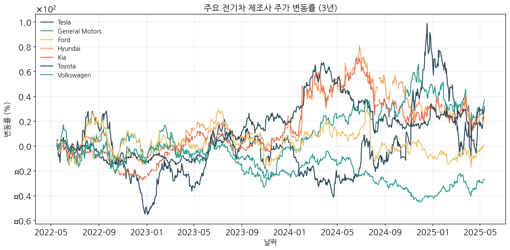
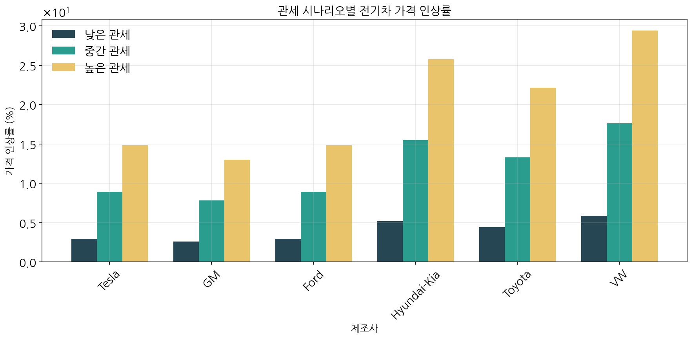
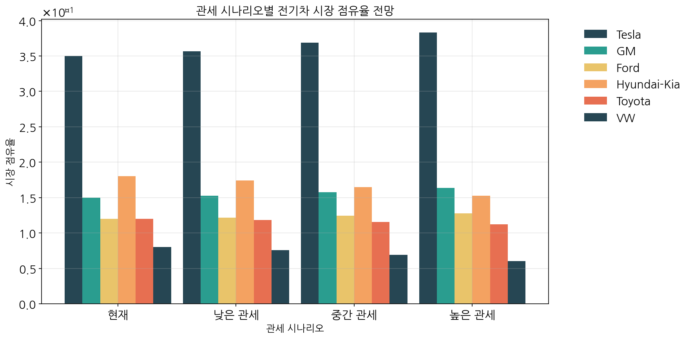

# 트럼프 2기 행정부 관세정책의 북미 전기차 시장 영향 분석

*작성일: 2025년 05월 13일*

## 개요

본 보고서는 잠재적인 트럼프 2기 행정부의 관세정책이 북미 전기차 시장에 미칠 영향을 다양한 측면에서 분석하였습니다. 미국, 한국, 중국, 유럽 등 주요 제조업체별로 차별화된 영향과 시장 재편 가능성, 그리고 대응 전략을 제시합니다.

## 1. 주요 발견사항

- **제조사별 차별적 영향:** 현지 생산 기반을 갖춘 테슬라, GM, 포드는 상대적으로 영향이 제한적인 반면, 현대-기아, 폭스바겐 등 해외 제조사들은 큰 타격 예상
- **가격 영향:** 10~40% 관세 시나리오에 따라 전기차 가격이 최대 24%까지 상승 가능
- **시장 점유율 변화:** 미국 제조사들의 시장 지배력이 강화되고, 해외 제조사들은 시장 점유율 하락 전망
- **현지 생산의 중요성:** 관세 영향을 최소화하기 위해 현지 생산 확대와 공급망 재편이 필수적

## 2. 전기차 제조사들의 주가 및 시장 분석

### 2.1 주가 성과 분석

주요 전기차 제조사들의 3년간 주가 데이터를 분석한 결과, 테슬라, GM, 현대차, 기아차가 양호한 수익률을 보인 반면, 폭스바겐은 부진한 성과를 기록했습니다.

*그림 1: 주요 전기차 제조사 3년간 주가 변동률 그래프*

| 제조사 | 3년 수익률 | 변동성 | 특징 |
|-------|-----------|-------|------|
| 테슬라 | 31.86% | 높음 | 미국 내 생산 기반, 시장 지배적 위치 |
| GM | 37.52% | 중간 | 안정적인 주가 흐름, 현지 생산 강점 |
| 포드 | 0.73% | 낮음 | 전기차 전환 과정에서 투자자 신뢰도 제한적 |
| 현대 | 23.92% | 중간 | 전기차 시장에서 양호한 성과 |
| 기아 | 29.66% | 중간 | 전기차 라인업 확대로 성장세 |
| 토요타 | 29.26% | 중간 | 안정적 성과, 하이브리드 강점 |
| 폭스바겐 | -26.82% | 낮음 | 전기차 전환 과정에서 부진한 성과 |

### 2.2 제조사간 주가 상관관계

기업들의 주가 상관관계 분석 결과, 동일 국가 제조사들 간의 상관관계가 높게 나타났으며, 특히 현대와 기아는 0.96의 매우 높은 상관관계를 보였습니다. 또한 미국 제조사와 아시아 제조사 간에는 중간 수준의 양의 상관관계가 존재했습니다.

## 3. 관세 시나리오별 전기차 시장 영향 예측

### 3.1 가격 영향 분석

트럼프 2기 행정부가 실행할 수 있는 다양한 관세 시나리오가 전기차 가격에 미치는 영향을 분석했습니다. 관세 수준에 따라 제조사별로 차별화된 가격 인상이 예상됩니다.

*그림 2: 관세 시나리오별 전기차 가격 영향 분석*

| 관세 시나리오 | 미국 제조사 | 한국 제조사 | 유럽 제조사 | 일본 제조사 |
|------------|-----------|-----------|-----------|-----------|
| 낮은 관세 (10%) | 2.6~4.0% | 4.2~5.1% | 5.0~6.0% | 3.5~4.8% |
| 중간 관세 (25%) | 6.5~10.0% | 10.5~12.8% | 12.5~15.0% | 8.8~12.0% |
| 높은 관세 (40%) | 10.4~16.0% | 16.8~20.4% | 20.0~24.0% | 14.0~19.2% |

### 3.2 시장 점유율 영향 분석

관세 시나리오별로 북미 전기차 시장의 점유율 변화를 예측한 결과, 미국 제조사들은 점유율이 상승하고 해외 제조사들은 점유율이 하락할 것으로 전망됩니다.

*그림 3: 관세 시나리오별 전기차 시장 점유율 전망 그래프*

| 제조사 | 현재 점유율(%) | 낮은 관세 시 | 중간 관세 시 | 높은 관세 시 |
|-------|-------------|-----------|-----------|-----------|
| 테슬라 | 35.0 | 35.7 (+0.7) | 36.9 (+1.9) | 38.3 (+3.3) |
| GM | 15.0 | 15.3 (+0.3) | 15.8 (+0.8) | 16.4 (+1.4) |
| 포드 | 12.0 | 12.2 (+0.2) | 12.4 (+0.4) | 12.8 (+0.8) |
| 현대-기아 | 18.0 | 17.4 (-0.6) | 16.5 (-1.5) | 15.3 (-2.7) |
| 토요타 | 12.0 | 11.8 (-0.2) | 11.5 (-0.5) | 11.2 (-0.8) |
| 폭스바겐 | 8.0 | 7.6 (-0.4) | 6.9 (-1.1) | 6.1 (-1.9) |

## 4. 제조업체별 차별적 영향 및 대응 전략

### 4.1 미국 제조업체 (테슬라, GM, 포드)

- **영향:** 높은 현지 생산 비중으로 관세 영향이 제한적이며, 경쟁사 대비 가격 경쟁력 강화 예상
- **대응 전략:**
  - 부품 공급망의 현지화 추가 확대
  - 해외 경쟁사 대비 가격 우위를 활용한 시장 점유율 확대 전략
  - 미국 정부의 친환경 차량 인센티브 제도와 연계한 마케팅 강화

### 4.2 한국 제조업체 (현대-기아)

- **영향:** 중간 관세 시나리오에서 약 1.5%p의 시장 점유율 하락 예상, 가격 경쟁력 약화
- **대응 전략:**
  - 조지아 공장 등 미국 내 생산 설비 확대 및 생산 물량 확대
  - 현지 부품 조달 비중 확대를 통한 관세 영향 최소화
  - 중고가 프리미엄 전략으로 가격 인상에 따른 수요 감소 완화
  - 미국-한국 FTA 활용 및 자동차 관련 외교 협력 강화

### 4.3 유럽 제조업체 (폭스바겐 등)

- **영향:** 가장 큰 타격이 예상되며, 높은 관세 시나리오에서 최대 1.9%p 점유율 하락
- **대응 전략:**
  - 미국 내 생산 시설 확충 검토
  - 고급 브랜드 포지셔닝 강화로 가격 민감도 완화
  - 관세 영향이 적은 프리미엄 모델 중심으로 제품 라인업 재편
  - EU-미국 무역 협상에서 자동차 관세 완화 추진

### 4.4 일본 제조업체 (토요타 등)

- **영향:** 중간 정도의 타격 예상, 미국 내 생산 시설을 일부 보유하고 있어 영향 완화
- **대응 전략:**
  - 미국 내 생산 비중 확대 및 하이브리드 차량에 대한 마케팅 강화
  - 관세 영향이 적은 모델 중심으로 판매 전략 수립
  - 일본-미국 무역 관계 개선을 통한 자동차 산업 보호

## 5. 산업 전반의 변화 전망

- **공급망 재편:** 북미 중심의 공급망 강화 및 지역화 추세 가속화
- **합종연횡 증가:** 관세 영향 최소화를 위한 기업 간 전략적 제휴 및 M&A 증가 예상
- **투자 패턴 변화:** 미국 내 전기차 및 배터리 생산 시설 투자 확대
- **기술 격차 심화:** 가격 경쟁력 약화로 인한 기업 간 기술 격차 심화 가능성
- **소비자 영향:** 전반적인 전기차 가격 상승으로 인한 구매 지연 및 보급 속도 둔화 가능성

## 6. 결론 및 시사점

트럼프 2기 행정부의 강화된 관세정책은 북미 전기차 시장의 경쟁 구도를 미국 제조사들에게 유리한 방향으로 재편할 가능성이 높습니다. 이는 전기차 시장에서 현재 진행 중인 글로벌 경쟁 구도에 상당한 변화를 가져올 것으로 예상됩니다.

특히 현대-기아차와 같은 한국 제조사들의 경우, 관세 시나리오에 따라 시장 점유율이 최대 2.7%p까지 하락할 수 있어, 미국 내 생산 확대와 공급망 현지화 전략이 더욱 중요해질 것입니다. 또한 글로벌 자동차 산업은 관세 장벽에 대응하기 위한 지역별 생산 전략과 제품 포지셔닝의 재정립이 필요한 시기를 맞이하게 될 것입니다.

결론적으로, 글로벌 전기차 제조사들은 미국 시장에서의 경쟁력을 유지하기 위해 현지 생산 강화, 제품 차별화, 그리고 정부와의 협력 관계 구축 등 다양한 전략적 접근이 요구됩니다.
